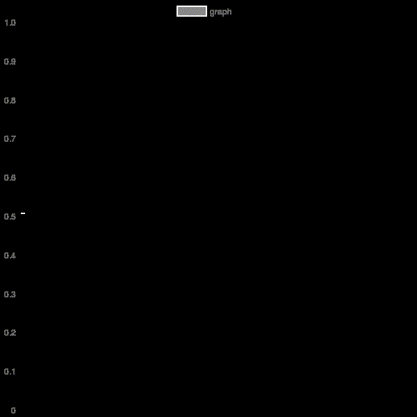

<p align="center">
  <a href="https://travis-ci.org/piercus/videoplot"></a>
  <a href="https://www.npmjs.com/piercus/videoplot"></a>
  <a href="https://www.npmjs.com/package/videoplot"></a>
</p>

## Install

### Prerequisites

Having ffmpeg installed on your computer see [fluent-ffmpeg prerequisites](https://github.com/fluent-ffmpeg/node-fluent-ffmpeg#prerequisites)

### Npm installation

```bash
npm install videoplot
```

## Example
| First example (1 simple curve)| Second example (3 curves)|
|---|---|
|| |


## Usage

```js
const Videoplot = require('videoplot');

var plot = new Videoplot({ w:600, h:600, duration: 30, fps: 8 });

// create random data
const y = [];
for(var i = 0; i< 10; i++){
	y.push(Math.random());
}

// chartjs dataset format

const datasets = [];
datasets.push({
	label : "graph",
	borderColor: "#FFFFFF",
	backgroundColor: "#888888",
	fill: false,
	data : y
});

// chartjs dataset format
plot.drawVideoChart({
		type: 'line',
		wScale: 4,
		data: {
			datasets : datasets
		},
		options: {
			elements: {
				point : {
					pointStyle : 'line'
				}
			},
			scales: {
				xAxes: [{
					ticks: {
						display: false
					}
				}],
				yAxes: [{
					ticks: {
						display: false,
						beginAtZero: true,
						suggestedMax: 1
					}
				}],
			}
		}
})
.then(() => {
	console.log("Chart is created");
	// chart is created
	return plot.writeVideoToFile({filename: './examples/example.gif'});
	//return plot.getVideoStream('image/gif');
})
.catch(err => {
	console.error("Error : ", err)
})
.then(() => {
	console.log("Chart is saved into ./examples/example.gif");
})

```

## Documentation

Documentation is inside the code as JSDoc.

## TO DO

* better x scale management (labels ...)
* more chartjs options handling
* video output handling

## Thanks

Thanks to [fluent-ffmpeg](https://github.com/fluent-ffmpeg/node-fluent-ffmpeg) and [chartjs-node](https://www.npmjs.com/package/chartjs-node)
